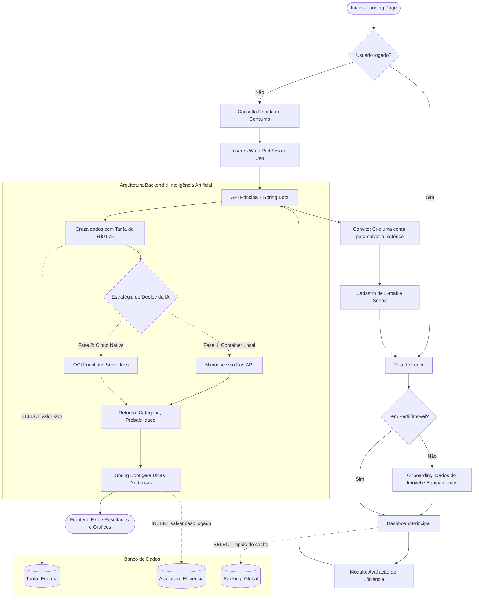
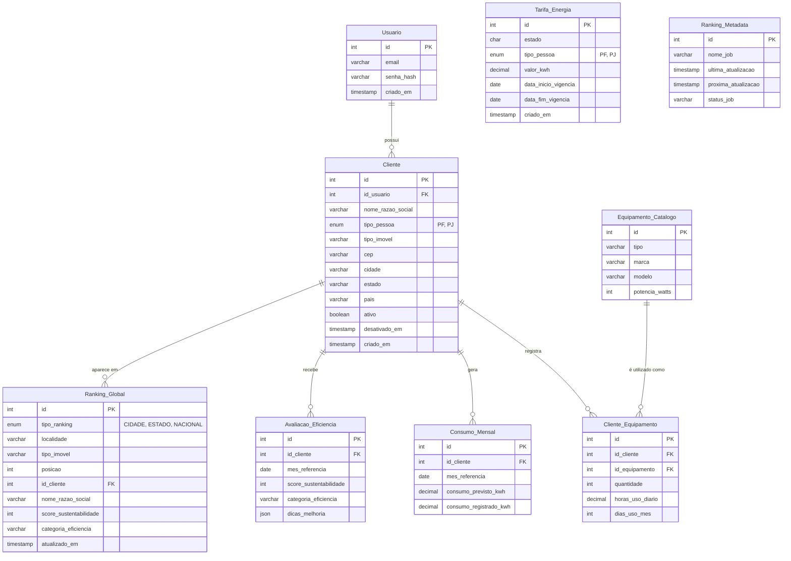

## Diagrama de Fluxo

```mermaid
graph TD
    %% ==========================================
    %% JORNADA DO USUÁRIO (FRONTEND - VUE.JS)
    %% ==========================================
    Start([Início - Landing Page]) --> DecisionAuth{Usuário logado?}

    %% Consulta Sem Login
    DecisionAuth -- "Não" --> ConsultaRapida[Consulta Rápida de Consumo]
    ConsultaRapida --> InputBasico[Insere kWh e Padrões de Uso]
    InputBasico --> API_SpringBoot
    
    %% Autenticação e Onboarding
    API_SpringBoot --> CTA[Convite: Crie uma conta para salvar o histórico]
    CTA --> Cadastro[Cadastro de E-mail e Senha]
    DecisionAuth -- "Sim" --> Login[Tela de Login]
    Cadastro --> Login
    
    Login --> VerificaPerfil{Tem Perfil/Imóvel?}
    VerificaPerfil -- "Não" --> CadastraCliente[Onboarding: Dados do Imóvel e Equipamentos]
    CadastraCliente --> Dashboard
    VerificaPerfil -- "Sim" --> Dashboard[Dashboard Principal]
    
    Dashboard --> ModuloIA[Módulo: Avaliação de Eficiência]
    ModuloIA --> API_SpringBoot

    %% ==========================================
    %% ORQUESTRAÇÃO (BACKEND E IA)
    %% ==========================================
    subgraph Arquitetura Backend e Inteligência Artificial
        API_SpringBoot[API Principal - Spring Boot]
        API_SpringBoot --> CalcFinanceiro[Cruza dados com Tarifa de R$ 0.75]
        CalcFinanceiro --> DefineInfraIA{Estratégia de Deploy da IA}
        
        DefineInfraIA -. "Fase 1: Container Local" .-> IA_FastAPI[Microsserviço FastAPI]
        DefineInfraIA -. "Fase 2: Cloud Native" .-> IA_OCI[OCI Functions Serverless]
        
        IA_FastAPI --> RetornoIA[Retorna: Categoria, Probabilidade]
        IA_OCI --> RetornoIA
        
        RetornoIA --> GeraDicas[Spring Boot gera Dicas Dinâmicas]
    end
    
    GeraDicas --> ExibeResultados([Frontend Exibe Resultados e Gráficos])

    %% ==========================================
    %% PERSISTÊNCIA (BANCO DE DADOS MYSQL)
    %% ==========================================
    subgraph Banco de Dados
        T_Tarifa[(Tarifa_Energia)]
        T_Avaliacao[(Avaliacao_Eficiencia)]
        T_Ranking[(Ranking_Global)]
    end

    %% Integrações de Leitura/Escrita
    CalcFinanceiro -.->|SELECT valor kwh| T_Tarifa
    GeraDicas -.->|INSERT salvar caso logado| T_Avaliacao
    Dashboard -.->|SELECT rapido de cache| T_Ranking
```

## Diagrama Entidade Relacionamento

```mermaid
erDiagram
    Usuario ||--o{ Cliente : "possui"
    Usuario {
        int id PK
        varchar email
        varchar senha_hash
        timestamp criado_em
    }

    Cliente ||--o{ Cliente_Equipamento : "registra"
    Cliente ||--o{ Consumo_Mensal : "gera"
    Cliente ||--o{ Avaliacao_Eficiencia : "recebe"
    Cliente ||--o{ Ranking_Global : "aparece em"
    Cliente {
        int id PK
        int id_usuario FK
        varchar nome_razao_social
        enum tipo_pessoa "PF, PJ"
        varchar tipo_imovel
        varchar cep
        varchar cidade
        varchar estado
        varchar pais
        boolean ativo
        timestamp desativado_em
        timestamp criado_em
    }

    Equipamento_Catalogo ||--o{ Cliente_Equipamento : "é utilizado como"
    Equipamento_Catalogo {
        int id PK
        varchar tipo
        varchar marca
        varchar modelo
        int potencia_watts
    }

    Cliente_Equipamento {
        int id PK
        int id_cliente FK
        int id_equipamento FK
        int quantidade
        decimal horas_uso_diario
        int dias_uso_mes
    }

    Consumo_Mensal {
        int id PK
        int id_cliente FK
        date mes_referencia
        decimal consumo_previsto_kwh
        decimal consumo_registrado_kwh
    }

    Avaliacao_Eficiencia {
        int id PK
        int id_cliente FK
        date mes_referencia
        int score_sustentabilidade
        varchar categoria_eficiencia
        json dicas_melhoria
    }

    Ranking_Global {
        int id PK
        enum tipo_ranking "CIDADE, ESTADO, NACIONAL"
        varchar localidade
        varchar tipo_imovel
        int posicao
        int id_cliente FK
        varchar nome_razao_social
        int score_sustentabilidade
        varchar categoria_eficiencia
        timestamp atualizado_em
    }

    Tarifa_Energia {
        int id PK
        char estado
        enum tipo_pessoa "PF, PJ"
        decimal valor_kwh
        date data_inicio_vigencia
        date data_fim_vigencia
        timestamp criado_em
    }
    
    Ranking_Metadata {
        int id PK
        varchar nome_job
        timestamp ultima_atualizacao
        timestamp proxima_atualizacao
        varchar status_job
    }

```